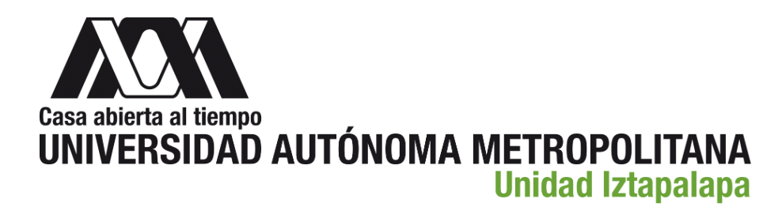

# Exploración y Predicción de la Incidencia Delictiva en la CDMX (2015-2025)

**Maestría en Matemáticas Aplicadas**

Alan Badillo Salas (cbi2242800355@xanum.uam.mx)

>       Tópicos Selectos de Matemáticas Aplicadas II
>       Análisis de Datos (2138002)
> 
> **Proyecto Final**
> 
> *Trimestre: 25-P*
>
> Profesor: Dr. Juan Alberto Martínez Cadena

## Introducción

En este proyecto se hará un análisis exploratorio mediante reportes de concentrados y visualización de datos, para modelar patrones de delitos registrados en la Ciudad de México entre 2015 y 2025, enfocados en la evolución temporal, distribución geográfica por alcaldía y predicción futura de incidentes delictivos seleccionados.

El conjunto de datos estudiado contiene registros mensuales de incidencia delictiva en la CDMX, desagregados por año, municipio (alcaldía), tipo de delito, subtipo y modalidad. 

Este *dataset* es apto estudiar la evolución de la violencia urbana y evaluar el impacto de eventos críticos como la pandemia por COVID-19.